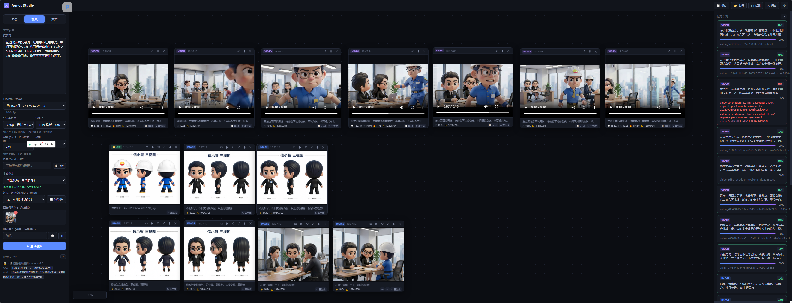

# My Agnes Studio

> 单文件 Web 应用 · 无限画布 + 多模态 AI 生成工作台（图文视频·文本对话·运镜库）
>
> 前沿模型 免费畅用 让AI属于每个人

一行简介：**`agnes-studio.html` 是入口文件，所有功能都在里面——把灵感 → 图 → 视频 → 文案在同一个画布上串起来。**

![badge: 单文件 SPA]
![badge: 零依赖]
![badge: 离线可用]

## 📸 Demo

### 🖼️ 图像



### 🎬 **[▶ 点击观看 Demo 视频](https://github.com/onemadefree/AgnesStudio/issues/1)**

> 💡 视频约 10 秒 · 2.5 MB · GitHub 不允许在 README 内联播放 mp4，点击跳到 Issue #1 看完整演示（已上传附件）

---

## ✨ 主要功能

### 🎨 图像（`agnes-image-2.1-flash`）
- **3 种生成模式**：文生图（t2i）/ 图生图（i2i）/ 多图融合（multi）
- **5 种预设尺寸**：含 1:1 / 16:9 / 3:2 / 3:4 / 2:3
- 参考图：节点 ↺ 按钮、本地上传（多选）、URL、Ctrl+V 粘贴
- 反推看图 → 英文 prompt → 译中文 → 节点右侧 popover 一键回填

### 🎬 视频（`agnes-video-v2.0`）
- **3 种生成模式**：文生视频（t2v）/ 图生视频（i2v）/ 首尾帧动画（keyframes）
- **3 档分辨率 × 5 比例**：480p / 720p / 1080p × 16:9 / 9:16 / 1:1 / 4:3 / 3:4
- 帧数 8n+1 校验，帧率 12/16/24/30，seed 可固定可随机
- 反向提示词模板（3 套）一键填入
- 异步任务自动轮询（10s 间隔可调），状态/进度条/视频 ID 实时显示

### 📝 文本（`agnes-2.0-flash`）
- **流式输出（SSE）+ 多轮对话 + 图像理解**
- **6 个系统角色**：
  - 🤖 通用助手 / 🌐 翻译专家
  - 🎬 **分镜描述专家** — 按 5 段格式输出（画面 / 镜头 / 时长 / 转场 / 台词）
  - 🎞️ **影视脚本优化专家** — 5 维度优化
  - 🔍 **图片反推** — 输出英文 prompt 50-100 词
- 角色联动：脚本优化完自动拆解分镜；分镜描述完自动选中运镜

### 🎥 运镜库（33 种 / 5 组）
- 基础控制（推 / 拉 / 摇 / 移 / 升 / 降 / 变焦） / 人物跟拍 / 揭示转场 / 情绪强化 / 空间航拍
- 选中后自动拼到 prompt 末尾，节点 meta 同步展示
- 可视化预览 modal（含剪映官方示范图 / 视频）

### 🖼️ 无限画布
- 滚轮缩放（0.1-8×，以鼠标为中心）
- 空格 + 拖 / 中键拖 = 平移
- 节点拖拽 / 删除键 / 双击全屏预览
- 任务面板（实时状态、错误回显、计数）
- 反推结果 popover 跟随节点移动

### 💾 持久化 + 协作
- 节点 / 任务 / 视图 / 表单状态全部保存到 localStorage，启动自动恢复
- 导出 / 导入画布 JSON（4MB 阈值用文件备份，避免 5MB 上限爆掉）
- 历史版本归档在 `history/`（按 `agnes-studio-vN.html` 命名）

### 🛡️ 容错
- 上游 5xx / 网络错误自动重试（最多 3 次，可配间隔）
- 失败节点一键重试（自动用 `sourceParams` 恢复原参数 + 复用节点位置）
- prompt 客户端预检（6 类高风险关键词）
- 视频 video_id 是 LiteLLM 伪 ID，自动解码为真实 ID

---

## 🚀 快速开始

```bash
# 1. 打开 agnes-studio.html
explorer agnes-studio.html          # Windows
open agnes-studio.html              # macOS
# 或直接双击文件
```

```bash
# 2. 配置 API（首次打开自动弹设置面板）
# 进入 [⚙ 设置] 填写：
#   - Base URL:   https://apihub.agnes-ai.com/v1
#   - API Key:    sk-xxxxx...（从 Agnes 控制台拿）
#   - 轮询间隔:   10000ms（视频任务）
```

```bash
# 3. 左侧输入提示词，点 [✦ 生成]
# 等几秒～几分钟，节点出现在画布中央，任务卡片出现在右侧
```

> ⚠️ **API Key 只存浏览器本地**（localStorage），不发给任何第三方。换电脑 / 换浏览器需要重新填。

---

## 📂 文件结构

```
agnes-studio/
├── README.md                   ← 你正在看的
├── AGENTS.md                   ← AI 助手项目遵循文档（备份规则 / API 协议 / 变更记录）
├── SPEC.md                     ← 功能规格文档（数据模型 / 改点速查 / 陷阱清单）
├── agnes-studio.html           ← 🔴 主文件（≈152 KB / 4063 行，单文件 SPA）
├── image_demo.png              ← README Demo 截图（界面）
├── video_demo.mp4              ← README Demo 视频（功能演示）
├── docs/                       ← Agnes 官方 API 文档离线副本
│   ├── agnes-2.0-flash.md
│   ├── agnes-image-2.1-flash.md
│   ├── agnes-video-v2.0.md
│   └── llms-index.md
└── history/                    ← 历史版本归档（v1~vN）
    └── agnes-studio-vN.html
```

---

## 🧰 技术栈

| 维度 | 选型 |
|---|---|
| 容器 | 单 HTML 文件，无构建步骤 |
| 样式 | 原生 CSS + CSS 变量（`:root` 统一管理） |
| 逻辑 | 原生 ES2020+ JavaScript，零框架 |
| HTTP | `fetch` + 统一 `callApi` / `callApiWithRetry` |
| 流式 | 裸 fetch + SSE 解析（`TextDecoder`） |
| 持久化 | `localStorage`（配置 + 画布 JSON） |
| 节点渲染 | DOM + CSS Transform（自实现平移 / 缩放） |

**零依赖**：没有 npm、没有 React/Vue、没有打包工具，所有功能内联在 HTML 文件里。

---

## 🔧 三模型速查

| 模型 | 端点 | 用途 |
|---|---|---|
| `agnes-image-2.1-flash` | `POST /v1/images/generations` | 同步图像生成（T2I / I2I / Multi） |
| `agnes-video-v2.0` | `POST /v1/videos` + `GET /agnesapi?video_id=` | 异步视频（T2V / I2V / Keyframes） |
| `agnes-2.0-flash` | `POST /v1/chat/completions` | 文本聊天 + 反推 prompt + 翻译 |

详细协议见 [`docs/`](./docs/)，踩坑与边界见 [`SPEC.md §13 已知陷阱`](./SPEC.md)。

---

## ⚙ 常见操作

| 想做 | 怎么操作 |
|---|---|
| 加图生图参考 | 点图节点底部 `▭` |
| 加图生视频参考 | 点图节点底部 `▶` |
| 看图反推 prompt | 点图节点底部 `⟲` |
| 重试失败节点 | 点节点底部 `↻`（失败时才有） |
| 切换反推中英文 | 反推后点节点 `🇨🇳` / `🇺🇸` |
| 复制视频 seed | 视频节点点 `📋 seed` |
| 重生成（用此 prompt） | 节点点 `↻ 重生成` |
| 选中运镜 | 视频模式，左栏"运镜"select 或点 `📖 预览库` |
| 自动恢复存错的任务 | 设置面板 → 粘贴 `video_id` → 点查询 |
| 备份/分享画布 | 顶部 `💾 保存` → 选 JSON 文件 |
| 清空画布 | 顶部 `✕ 清空` |

详细快捷键见 [`SPEC.md §11`](./SPEC.md)。

---

## 📚 文档索引

- 📘 **本 README** — 一页速览、新人上手
- 🛠️ **[AGENTS.md](./AGENTS.md)** — 给接手这个项目的 AI 助手看的（备份规则 / API 协议 / 变更记录）
- 📖 **[SPEC.md](./SPEC.md)** — 功能规格文档（数据模型 / 模块划分 / 修改入口索引）
- 📜 **[docs/](./docs/)** — Agnes 官方 API 文档本地副本

---

## 🔍 浏览器兼容

| 浏览器 | 支持 | 备注 |
|---|---|---|
| Chrome / Edge 100+ | ✅ | 推荐 |
| Firefox 100+ | ✅ | OK |
| Safari 15+ | ✅ | OK |
| IE 11 | ❌ | 不支持（用了 ES2020+ + `Map` + optional chaining） |

需要授权**跨域访问** Agnes API（`apihub.agnes-ai.com`）。如果遇到 CORS 错误，建议部署一个轻量代理或打开浏览器扩展放行。

---

## 🚧 后续可扩展方向（TODO）

- 多画布 / 项目管理（左侧栏树状结构）
- 节点对齐辅助线 + 吸附
- 关键帧动画的可视化编辑器
- 历史版本回滚（从 `history/` 一键恢复）
- 提示词自建模板库
- 节点连线 / DAG 工作流
- 反推结果批量导出

要加新功能前先看 [`SPEC.md §12 修改入口索引`](./SPEC.md)，找对应的代码段。

---

## 📜 License

项目内自用，暂未开源。如需对外发布可加 `MIT` 或 `Apache-2.0`。
